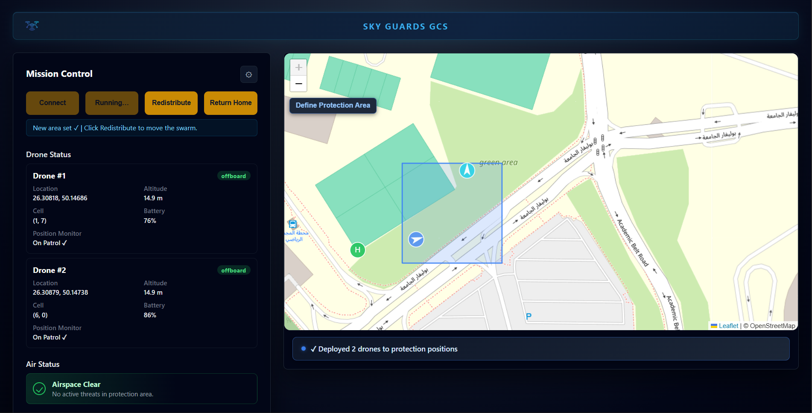
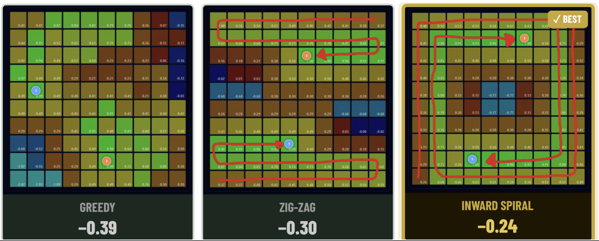
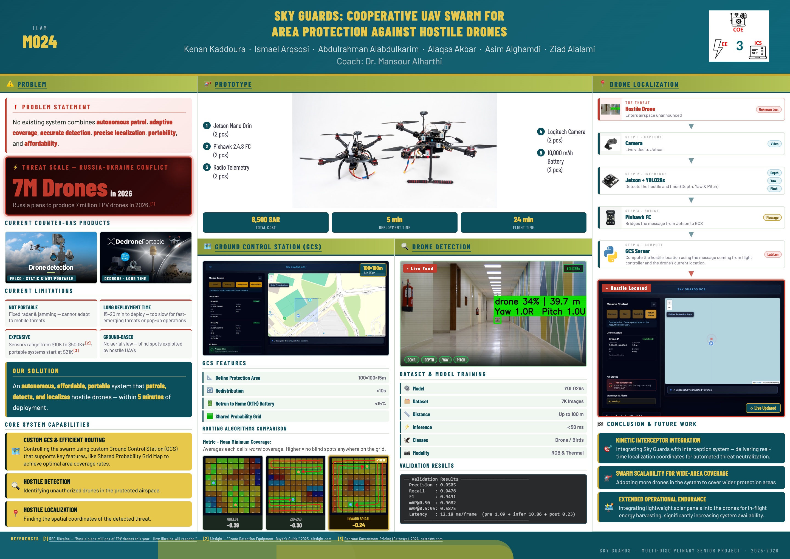

# Sky Guards: Cooperative UAV Swarm for Area Protection Against Hostile Drones

**Team M024** — KFUPM Multidisciplinary Senior Project · 2025–2026

Kenan Kaddoura · Ismael Arqsosi · Abdulrahman Alabdulkarim · Alaqsa Akbar · Asim Alghamdi · Ziad Alalami
Coach: Dr. Mansour Alharthi

**Demo video:** https://www.youtube.com/watch?v=5gTlGVEdDx0

---

> ## ⚠️ Notice: Shared Team Work, No Source Code, Confidential
>
> This repository intentionally contains **documentation only, no source code, model weights,
> CAD files, or configuration**. A few things to know before reading further:
>
> - **This is joint work.** The system, algorithms, and results described here were designed
>   and built collectively by the six team members listed above, under the supervision of our
>   coach. No single author may claim sole ownership of the ideas, code, or data in this project.
> - **Multiple components are deliberately withheld.** Implementation details for the routing
>   algorithm, the detection pipeline, the localization method, and the GCS architecture are
>   described here only at a summary level. The full implementation, trained models, datasets,
>   network/simulation configuration, and launch commands are kept private among the team.
> - **This project may be carried forward into a patent filing or a startup.** The team is
>   actively evaluating that path. Until any IP is formally filed and/or the team agrees
>   otherwise in writing, nothing in this repository or its description should be treated as
>   public domain, reused, reproduced, or built upon without the explicit written consent of
>   all listed team members.
> - If you are a recruiter, professor, or reviewer and need more detail than what's documented
>   here, please reach out directly to the team rather than assuming this document is exhaustive.

---

## Problem

No existing counter-UAS (counter-drone) system on the market combines **autonomous patrol,
adaptive coverage, accurate detection, precise localization, portability, and affordability**
in one platform.

Current counter-UAS products fall short in at least one of these dimensions:

| Limitation | Description |
|---|---|
| **Not portable** | Fixed radar and jamming systems can't adapt to mobile threats |
| **Long deployment time** | 15–20 minutes to deploy, too slow for fast-emerging or pop-up threats |
| **Expensive** | Sensors range from $10K to $500K+; portable systems start around $21K |
| **Ground-based** | No aerial vantage point, leaving blind spots hostile UAVs can exploit |

This gap matters at scale: Russia alone plans to produce roughly 7 million FPV drones in 2026,
underscoring how fast low-cost hostile drone activity is growing.

## Our Solution

An autonomous, affordable, portable two-drone swarm system that **patrols, detects, and
localizes** hostile drones, fully deployable in under five minutes, for a total prototype cost
of roughly 8,500 SAR.

### Core Capabilities

- **Custom Ground Control Station (GCS) & efficient routing** — coordinates the swarm and
  supports key features such as a Shared Probability Grid Map for optimal area coverage.
- **Hostile detection** — identifies unauthorized drones in the protected airspace.
- **Hostile localization** — computes the spatial coordinates of a detected threat.

## System Architecture (Summary)

The pipeline, at a high level:

1. **Capture** — an onboard camera streams live video to the Jetson.
2. **Inference** — an onboard AI model detects the hostile drone and estimates depth, yaw,
   and pitch.
3. **Bridge** — the flight controller relays the detection message from the onboard compute
   to the ground station.
4. **Compute** — the GCS server combines the incoming message with the drone's own telemetry
   to compute the hostile drone's real-world coordinates (lat/lon).

### Ground Control Station

A full-stack, asynchronous web application coordinating the swarm over MAVLink/MAVSDK, with a
live map-based operator view.

- Define a protection area (evaluated at 100×100×15 m in testing)
- Redistribute swarm coverage in under 10 seconds when conditions change
- Return-to-home triggered automatically below 15% battery
- Shared Probability Grid Map for intelligent, blind-spot-aware area coverage

Three routing strategies were implemented and compared using a mean-minimum-coverage metric
(the average of each grid cell's worst-case coverage — higher is better, meaning fewer blind
spots anywhere on the grid): a greedy approach, a zig-zag lawnmower pattern, and an inward
spiral. The inward spiral pattern performed best in testing.

### Drone Detection

- Model family: YOLO-based, fine-tuned for this task
- Trained on roughly 7,000 images
- Detects at ranges up to 100 m, with sub-50 ms inference on the Jetson Nano Orin
- Two classes: drone and bird (to reduce false positives from wildlife)
- Dual modality: RGB and thermal imaging, for day/night and low-visibility operation

### Threat Localization

Detected drone depth, yaw, and pitch (from onboard inference) are combined with the flight
controller's own telemetry at the GCS to compute the hostile drone's real-world coordinates,
providing an actionable location for downstream response systems.

## Prototype Hardware

| Component | Qty |
|---|---|
| Jetson Nano Orin | 2 |
| Pixhawk 2.4.8 flight controller | 2 |
| Radio telemetry module | 2 |
| Logitech camera | 2 |
| 10,000 mAh battery | 2 |

| Metric | Value |
|---|---|
| Total prototype cost | 8,500 SAR |
| Deployment time | 5 min |
| Flight time | 24 min |

## Results

Validation results from the detection model:

| Metric | Value |
|---|---|
| Precision | 0.9505 |
| Recall | 0.9476 |
| F1-score | 0.9491 |
| mAP@0.50 | 0.9682 |
| mAP@0.5:0.95 | 0.5875 |
| Latency | 12.18 ms/frame (pre 1.09 + infer 10.86 + post 0.23) |

## Tech Stack

Python (asyncio / Quart) · MAVLink / MAVSDK · JavaScript · Leaflet.js · WebSocket ·
ArduPilot SITL · NVIDIA Jetson Nano Orin · YOLO-based computer vision · thermal imaging

## Screenshots

### GCS — Mission Control

The operator-facing Ground Control Station: live map of the protection area, per-drone status
(location, altitude, grid cell, battery, patrol state), swarm-wide controls (connect,
redistribute, return home), and airspace status.



### Routing algorithm comparison

Side-by-side comparison of the three coverage routing strategies tested on the Shared
Probability Grid Map, scored by mean-minimum coverage (higher/less negative is better). The
inward spiral pattern (right) scored best, with the least negative mean-minimum coverage of
the three.



### Project poster

The full senior design poster: problem statement, market landscape, prototype hardware,
GCS and detection subsystems, localization pipeline, validation results, and future work.



## Repository Layout (High Level)

This repo is documentation-first and will grow over time. At a conceptual level, the (private)
implementation is organized as:

- **`GCS/`** — the Ground Control Station web app: the operator UI and its app runner.
- **`logic/`** — the Python scripts that operate the swarm.

The GCS follows a layered structure, from the operator UI down to individual drone control:

```
UI (browser)
   │  calls
   ▼
API wrapper (frontend → backend)
   │  HTTP requests
   ▼
App runner (thin HTTP layer: validates input, routes requests)
   │  imports & calls
   ▼
Mission logic (initializes the swarm, deploys to positions, handles return-home, etc.)
   │  uses
   ▼
Low-level drone control
```

Local simulation (SITL) setup, network configuration, and exact launch commands are kept out
of this document per the confidentiality notice above; team members can refer to the internal
setup notes.

## Conclusion & Future Work

- **Kinetic interceptor integration** — pairing Sky Guards with an interception system,
  delivering real-time localization coordinates for automated threat neutralization.
- **Swarm scalability for wide-area coverage** — adding more drones to cover larger
  protection areas.
- **Extended operational endurance** — integrating lightweight solar panels for in-flight
  energy harvesting, meaningfully increasing system availability.

## References

1. RBC-Ukraine, "Russia plans millions of FPV drones this year — How Ukraine will respond."
2. Airsight, "Drone Detection Equipment: Buyer's Guide," 2025, airsight.com
3. Dedrone Government Pricing (Petrosys), 2024, petrosys.com

---

*Sky Guards · Multi-Disciplinary Senior Project · 2025–2026*
